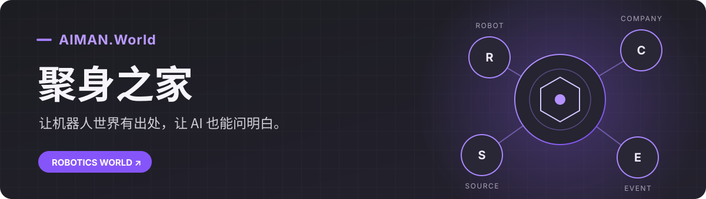

# 聚身之家 · AIMAN.World

**找机器人、看产业、追进展，也让 AI 用有出处的资料回答问题。**

聚身之家是 AIMAN.World 的机器人产业入口。从机器人或企业出发，你可以沿着已有记录查看零部件、产业关系、事件和资料来源。暂时没有查到的信息会保留为未知，方便继续核对。

| 🧭 [去官网探索](https://www.aiman.world/) | 📖 [读开发专栏](DEVELOPER_COLUMN.md) | 🤖 [让 AI 接入](AI_ONBOARDING.md) | 💜 [支持项目](SUPPORT.md) |
| :--- | :--- | :--- | :--- |
| 找产品、企业和产业线索 | 看我们怎样把资料查清楚 | 用公开 MCP 或 REST 查询 | Star、反馈或自愿赞助 |

## 从一个问题开始

- **“有哪些机器人值得进一步了解？”** 从[机器人库](https://www.aiman.world/robots)搜索候选，再打开产品详情。
- **“一家公司和谁有关联？”** 在[企业库](https://www.aiman.world/companies)和[产业图谱](https://www.aiman.world/graph)中查看已有关系及其方向。
- **“最近发生了什么？”** 从[时间线](https://www.aiman.world/timeline)和[文章](https://www.aiman.world/blog)继续阅读，并核对时间与来源。

资料会不断补齐。页面上的收录、参数或关联都应按其来源和当前审核状态理解；它们不等于采购或交付承诺。

## 开发专栏：把复杂的事讲明白

先读第一篇：[AI 怎样把一个机器人名字查成有出处的答案](column/01-from-name-to-evidence.md)。它用一次普通查询解释为什么要确认身份、看来源、保留未知。

更多短文与阅读入口放在[开发专栏](DEVELOPER_COLUMN.md)。需要接口细节时，直接看[官网开发者中心](https://www.aiman.world/developers)。

## 让 AI 接入

支持远程 MCP 的 AI 客户端，可连接 `https://www.aiman.world/mcp`；公开读取无需登录。客户端先发现当前工具，再按实时参数发起查询。不支持 MCP 的系统可以使用[公开 REST 接口](https://www.aiman.world/developers/robotics/api)。

[查看完整接入指南 →](AI_ONBOARDING.md) · [查看官方 Agent Card →](https://www.aiman.world/.well-known/agent-card.json)

## 一起支持

分享项目、反馈错误、提供可核验的线索，都是支持。愿意赞助公共建设的朋友，可阅读[官方支持说明](https://www.aiman.world/pricing#sponsor)，或前往[支持页查看微信支付捐赠二维码](SUPPORT.md#微信支付捐赠)。赞助不会改变事实审核或搜索排序。

## English

**AIMAN.World Robotics World (聚身之家)** helps people explore robots, companies, industry relationships, events, and the sources behind available records. Start at the [live site](https://www.aiman.world/), read the [developer column](DEVELOPER_COLUMN.md), [connect an AI agent](AI_ONBOARDING.md), or [support the project](SUPPORT.md). Live capabilities and data come from AIMAN.World.

更多公开文档与开源项目 / More public resources

- [官方开发者中心 / Developer portal](https://www.aiman.world/developers)
- [AI 接入指南 / AI onboarding](AI_ONBOARDING.md)
- [Reality-First Development](https://github.com/Azhu9701/reality-first-development) · 方法与 Agent 规范
- [Industry World Model](https://github.com/Azhu9701/industry-world-model) · 开放框架与参考实现
- [公开范围 / Open source scope](OPEN_SOURCE_SCOPE.md)
- [贡献指南](CONTRIBUTING.md) · [安全说明](SECURITY.md) · [MIT License](LICENSE)

